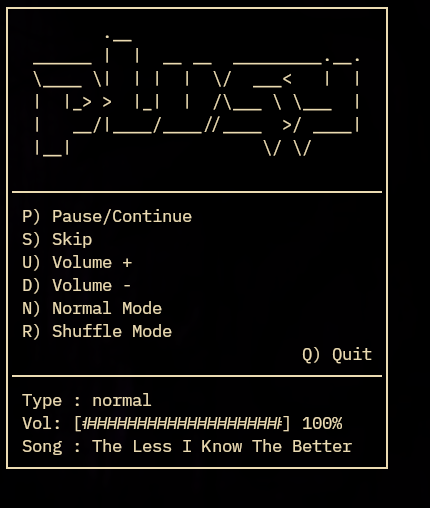

# plusy



Plusy is a simple tui music player written in c


## requirements
- mpv
- ncurses
- cmake


## structure 
```text
── src
   ├── main.c
   ├── setup_func.c
   ├── setup_func.h
   ├── song_func.c
   ├── song_func.h
   ├── tui.c
   ├── tui.h
   └── types.h
```

### installation

```bash
git clone https://github.com/piadi-su/plusy.git

cd plusy

chmod +x installer.sh

./installer.sh
```


